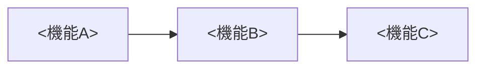

# <project> architecture（機能マップ）

> システムの全体像を人に説明する図。チャート/フロー図＋データの input/output＋各機能の役割（実装への MDリンク付き）で構成する。

## システム全体像

<!-- チャート/フロー図のプレースホルダ。mermaid か ASCII、書きやすい方でよい。
     箱=機能、矢印=データの流れ。詳細度は「人に説明できる」粒度まででよい（内部モジュール構造は書かない）。 -->

## データの入出力（I/O）

<!-- 図の各矢印に対応する input/output を表で正本化する。 -->

| 機能 | input | output |
|---|---|---|
| <機能A> | <取得元/受け取るデータ> | <生成物/渡す先> |

## 各機能の役割

<!-- 図の各箱に対応する役割と実装への参照。MDリンクは file:// か repo 相対パスで実体を指す。 -->

| 機能 | 役割（1行） | 実装への MDリンク |
|---|---|---|
| <機能A> | <何をするか> | `file:///path/to/repo/<path>` または `<repo>/<path>` |

## 責務・境界・オーナー

<!-- 誰が/何を担当するか（人・チーム・repo/vault の分担）。本ノートが vault 側の正本になる範囲を明記する。 -->

-

<!-- ※図は補助・正本は上の I/O・依存表。詳細なモジュール構造は repo 側を参照。 -->
