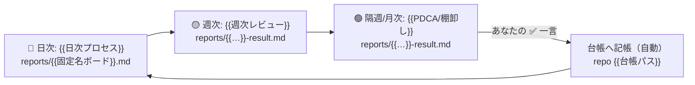
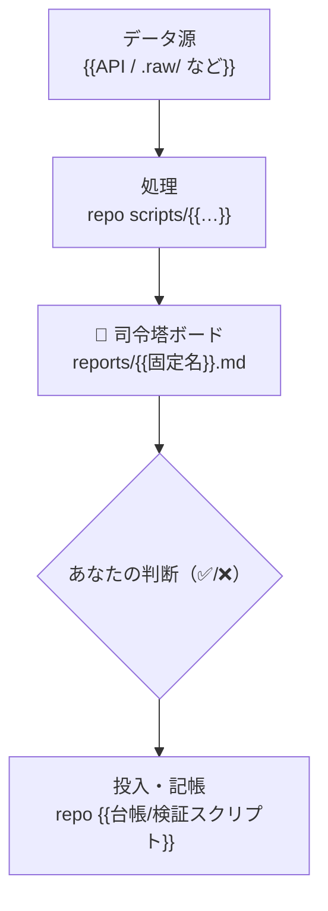

<!-- ═══════════════════════════════════════════════════════════════════
  これは「運用司令塔（command-center / 現状診断ボード）」の汎用 skeleton。
  毎日まず開く full レポートで、固定名 1 枚を上書き更新する（日付つきファイルを増やさない）。
  ★司令塔の定義 = この 1 枚で「判断」が完結する。だから中に必ず 3 つを持つ:
    ① サマリー（全体数字＋各単位の状態） ② なぜこの順か（ロジック） ③ やること
  リンク先に逃がすのは「長くてかさばる実体」だけ（生計算・全リスト・カタログ・地図）。
  サマリーと理屈は絶対に司令塔の中に残す（薄い索引化しない＝それは MOC の役目）。

  ★スロットの意味（ドメインで読み替える）:
    {{単位}}     = 切り分ける対象。広告=CP / CRM=セグメント / 営業=チャネル
    {{主要指標}} = 勝敗を決める 1 指標。広告=真ROAS / CRM=継続率 / 営業=CPA
    {{部品}}     = 打ち手を分解した構成要素（ドメイン依存）。広告=①KW ②広告文 ③掲載商品 ④入札
  ★広告ドメインの当てはめ実例（真ROAS 盛り係数・4 部品・6 軸表・学習リセット）は
    vault-report-writing skill の references/model-case-aiads-v2.md を併読
    （このテンプレ本文には特定ドメインの用語を焼き込まない）。
  ↓ {{ }} は毎回書き換える箇所。各表直後の <!-- 例 --> は prime_ad の記入見本。
═══════════════════════════════════════════════════════════════════ -->

# {{対象}} 司令塔（現状診断ボード）— 毎日まずここを開く

> **固定名・上書き更新**（日付つきファイルを増やさない）。順位の正本は [[{{NOWノート}}]]、打ち手の全リストは [{{実行ノート}}]。

## 📖 まず読むストーリー（30秒で全体像）

{{専門用語ゼロ・比喩で 3〜6 行。「全体ではこう／ただし内訳で病状が違う／だから順番はこう」}}

- **{{単位A・最重症}}** 🩸：{{平易な現状}} → {{処方}}
- **{{単位B・改善中}}** 🟢：{{現状}} → {{処方}}
- …（各単位 1 行・🟢 健全 / 🩸 出血 で示す）

**だから今日動かすのは {{N}} つだけ**：① {{…}} ／ ② {{…}}

<!-- 例(prime_ad): 全体0.92円の赤字／出会いCPが最大出血＝汎用ワード買い→止血／連絡は最下位だが立て直し中／だから今日は①連絡の止血②出会いの止血 -->

---

<!-- ★時間軸3層（2026-07-06 要件）: 司令塔の「やること」は時間軸で役割が変わる。
     🔴きょう(即実行・承認一言) / 🟡今週(週次で回るループの確認・✅待ち) / 🟢中長期(Phase・節目)。
     3層とも正本は repo（NOW.md / 定期実行result / phase-tracker）＝ここはリンクと要約のみ。 -->
> [!todo] 🎯 ゴール & やること（最初に読む・時間軸3層）
> **ゴール**: {{観測可能な成功基準・現在値→目標値・反転の順序}}
> **🟢 中長期（Phase・節目）**: {{Phase}} ｜ Exit 条件＝{{…}} ｜ 地図の正本 → [{{tracker}}]
> **🟡 今週（週次で回るループ）**: {{今週の判定物・定期実行 result へのリンク・✅待ちがあれば件数}}
> **🔴 きょう手を動かす順**（＝{{NOWノート}} スコア順のミラー｜**順位の正本は NOW.md**・ここは要約）:
>
> | 実行# | {{単位}} | 一手（具体・記号で済ませない） | なぜこの順（判定軸） | 投入状態 |
> |:--:|---|---|---|:--:|
> | {{NOW#1}} | {{…}} | {{…}} | {{確度 × 工数 × 期待増分}} | {{⏳未投入}} |
>
> **現在地**: {{今日UIトグルだけで着手可なもの。投入したら台帳(interventions.csv 等)に1行記録 → 自動計測}}

> [!success]- 結論（詳しい版・数字つき）
> **何が**: {{全体の主要指標と一言}}。
> **影響**: {{出血/改善の絶対量（件数・金額）}}。
> **次アクション**: {{上表の NOW#… を今日実行}}。

> [!abstract]- 💡 かみくだき解説：{{紛らわしい概念}}を分ける（初めて読む人向け）
> {{登場人物を 3 つに分け比喩で 1 つずつ／「覚えるのはこれだけ」で 1 行に圧縮／具体例}}

---

## 1. 現状：{{単位}}別の{{主要指標}}（{{重症度}}降順・"状態の地図"）

<!-- 重症度（出血額）降順＝「どの単位が重症か」の記述。「やる順」ではない（やる順は🎯表）。
     各行の 実行→ 列で NOW# を指し、2 つの順を 1 枚で突き合わせる。 -->

| {{単位}} | {{絶対量/件数}} | {{主要指標}} | 評価 | {{補助指標}} | 実行→ |
|---|--:|--:|:--:|--:|:--:|
| {{…}} | {{…}} | **{{…}}** 🩸 | … | … | {{NOW#…}} |
| **合算** | **{{…}}** | **{{…}}** | — | | — |

<!-- 例(prime_ad): Max ¥1,189k/真CV1,071/1.29🟢 ／ 出会い ¥708k/271/0.57🩸 ／ …合算 ¥2,876k/真CV1,802/0.92 -->

> ★ この表は **状態の地図＝やる順ではない**。やる順は🎯表（NOW スコア順）。**¥/確度/工数/score の生数字は書かない**（NOW.md が正本）。
> ★ {{主要指標}}は計測窓（frontmatter `period`）依存＝**窓を跨ぐ比較をしない**。**率だけでなく絶対量（件数）を必ず併記**。

**推移（前窓 → 今窓の Δ ＝移動方向）**: {{改善/悪化を絶対量つきで}}

## 2. {{単位}}別 詳細診断（各単位同型：現状 → 原因/判定 → 打ち手）

<!-- ↓ このブロックを単位の数だけ繰り返す。判断材料なので司令塔の中に置く。
     具体の全リスト（KW/ID 等）だけ実行ノートへリンクで降ろす。 -->

### {{単位名}}（{{主要指標値}}・{{一言診断}} → {{実行#}}）

{{1〜2 文の容態説明＋主レバーの宣言}}

| 軸 | 現状 | 評価 |
|---|---|---|
| {{絶対量}} | {{…}} | — |
| {{質指標}} | {{…}} | … |
| {{…部品…}} | {{…}} | … |

| | |
|---|---|
| **原因** | {{分解式で特定（例 真CPA = CPC ÷ 真CVR）}} |
| **判定** | {{何週後・何を見て・どの閾値で続行/撤退}} |

> [!todo] {{部品①}} — {{一手の要約}} 🩸 **主レバー**
> **やること**: {{番号付き手順・具体操作}}
> **なぜ**: {{短く・量の根拠}}
> > [!abstract]- ▸ 根拠の全リスト/ロジック（実行には読まなくてOK）
> > {{重い表・選定ロジック・訂正履歴をここへ退避}}

（…部品 ②③④ を同様に。触らない部品は `[!note] {{部品}} — 触らない` で「触らない＋理由」を 1 行）

<!-- 例(prime_ad)=6軸: cost/真CV/CPC/真CVR/KW構成/入札・着地。部品=①KW②広告文③掲載商品④入札。
     かぶせNGは①KW だけ（②③は重複OK）。真CPA=CPC÷真CVR で原因分解。詳細は model-case-aiads-v2.md -->

## 3. データ前提（必読）

- **窓の定義/重複事故**: {{rolling 窓は単純加算で二重計上・窓内の介入前後の日数構成を 1 文で}}
- **欠損**: {{取得欠落期間}}
- **指標の分子定義**: {{主要指標の正確な計算式・計測バイアス（例 管理画面値は約 3.1 倍盛り → 補正後を出し倍率を注記）}}
- **正本(SSoT)の所在**: {{repo/worktree の full・raw}}

> [!abstract]- 全文・分析スクリプト（正本は repo/worktree）
> 本ノートはサマリ。全文・raw は {{file:// 正本リンク}}。

## 4. 🗺 図解（役割が変わるものはビジュアルで・任意だが推奨・2026-07-06 要件）

<!-- 表で伝わらない2つ＝「時間軸のプロセス」と「システム設計＋ファイルの置き場所」は Mermaid で描く。
     ★ノードには必ず置き場所（パス）を併記する＝「そのファイルどこだっけ」をゼロにする。 -->

**(a) 時間軸プロセス図**（何が・いつ・自動/人間どちらで回るか）:

**(b) システム設計図＋置き場所**（データがどこから来てどこに着地するか）:

<!-- 例(prime_ad): 日次=cp-review更新 / 週次=ops-review / 隔週=biweekly-PDCA(✅承認欄) / 台帳=interventions.csv -->

## 関連（かさばる実体はここへ降ろす・司令塔にコピーしない）

| 何を見たい | 行き先（正本） |
|---|---|
| 順位のスコア生計算・工数・投入実態 | [[{{NOWノート}}]]（= repo `tasks/NOW.md`） |
| 止める/足す全リスト・ID・手順 | [{{実行ノート}}] |
| カタログ全文・統計根拠 | [{{measures / rationales}}] |
| Phase の地図（節目・Exit・今ここ） | [{{phase-tracker}}] |
| プロジェクト全体の地図（たまに俯瞰） | [[{{project_ope}}]] |

<!-- ═══ 自動生成ゾーン（rules/41 §④ 2026-06-14）─ 人間向け司令塔セクションより必ず下 ═══ -->
## 📋 Open Issues（ライブミラー・sync-vault-summary.py cmd_issues が末尾挿入）
<!-- 「## 🔁 最新更新ログ」は置かない＝禁止（git log / decisions.md の劣化コピー・rules/41 §④） -->
